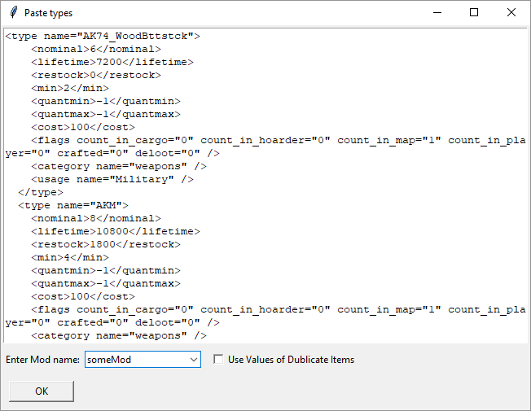
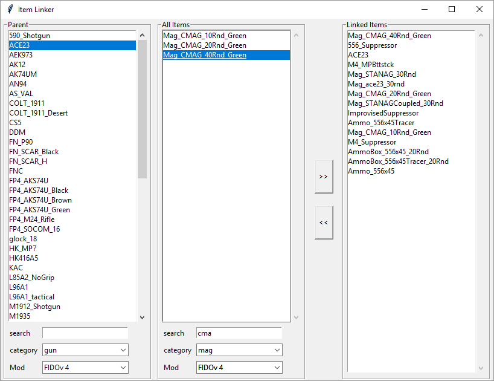

# DayZ LootEditor
DayZ Loot Editor for types.xml.
Helps with Visualizing end editing Loot. Has some Automatic functions for Loot distribution

- Visualize loot as a list from database
- Automatically creates Sub-types for weapon items and links items that are used together (guns, ammo, mags,...)
- Easily edit Loot Manually thanks to sub types and item linking
- Set Rarity of item
- Automatically generate distributions based on Rarity
- Set appearance of linked item (example: if gun is rare, the ammo is also rare)
- Export back to types.xml

Built upon a MySQL database that will be automatically generated and some manual editing of item links.
written in python.

## Install
first off you need MYSQL x64 Server and ODBC Driver 8.0 x64
- Download the installer [here](https://dev.mysql.com/downloads/windows/installer/8.0.html) the 20mb Version (no account needed scroll to the bottom of the page to download)

For minimal installation choose these settings:

Choose MYSQL Server x64 and Connector/ODBC 8.0 x64

Set a Password. I recommend `rootroot`. Does not need to be safe. It will be stored in plaintext!

Now download this app

### Developer install
- pyodbc
- pyinstaller

## First Startup
On startup you will see the connection window

1. Set the password to the one you set during setup of the database Server
2. Choose Create New, set a database Name eg. server name, choose a types xml to fill the databse for the first time
2. If you allready created a databse choose Use Existing, enter the name of the database and click Create/Test to test the connection
3. Click Create/Test it will create a new Database
4. You will see connection Success if everything worked
5. Click Set and now you're all set and can start editing your Loot

## Features
### Filtering Shown Items
In the top right corner there is a drop down, select item type and press Show items.
Click on an item and select view linked items. it will show all items you have linked to that item
Enter a keyword in the Name entry top left and press enter.

### Editing Items
1. Select an item or multiple by clicking shift or ctrl
2. change the Values you want
3. Click Update (type and rarity update instantly)

### Adding New Items
Paste new Items or Items that changed Values
Go to Database > Add Items...

1. Paste in all new Items you want to add
2. Enter the Name of the mod the new Items belong to
3. If the Item allready exists in the Database but you changed the Values somewhere else choose Use Value of Dublicate Item and it will change the Value of the item in the Database to the Value of the Pasted Item.
4. click OK

### Creating Item Links
To assosiated items with other items like ammo type to a gun 
go to Database > Create item links...
This is usefull for the spawning of the item with attachments and for distributing items that have a set rarity

The left list is for the parent object like the weapon. 
The list in the center is a list of all items here you can look for the item you want to link to the parent item.
The list on the right shows all items that are linked to the selected parent object. The parent object will appear there too and this is fine.

1. select a parent item in the left list
2. find the item that is linked in the center list by entering the item name in the search bar below use filter setting to help narrow your search
3. doubleclick the item to add it to the parent item as linked item
4. when done simply close the window, it saves progress automatically

### Mod Selector
Ticking mod names in the "Mods in use" menu, will remove the items from that mod.
Items that are in a mod that has been unticked will not export in the types.xml.
The Items will not be deleted they're just hidden.

### Setting Rarity
Nine Rarity types, if this is too many for you just use every second one.
The Rarity types have multipliers assigned to them:
#### Multipliers

| Rarity             | Multiplier |
| ------------------ | ---------- |
| undefined          | NaN        | 
| Legendary | 1 | 
| Extremely Rare | 1.5 | 
| Very Rare | 2 | 
| Rare | 2.5 | 
| Somewhat Rare | 3 | 
| Uncommon | 5 | 
| Common | 8 | 
| Very Common | 12 | 
| All Over The Place | 20 | 

### Rarity Distribution
This method isn't perfect it will only be a rough distribution to work with. You will have to adjust the loot after distribution
1. Set the rarity for all items of the type you want to distribute (undefined items will be ignored)
2. In the dropdown menu select the item type to distribute.
3. set Target Nominal. it's the nominal amount of all items of this type (excluding the items with undefined as rarity).
4. Only for guns: if Ammo or Mags is ticked the mags and ammo will also be distributed based on gun rarity. For example if many guns use STANAG it will spawn more often. Same for ammo types.
5. Click Distribute. This will take a while (working on this), it will still be faster than you doing all of this by hand!
6. Sometimes the nominals don't match what you set them to. Just select the items and edit them with the multiplier slider.

### Loot Multiplier
1. Select the items you want to increase or decrease with shift or ctrl.
2. set the multiplier
3. click Update

### item searching

search for items that contain the input in the name tag

### view linked items
select an item and click "view linked items":
it will show all items that can be attached to the item or are associated with it like ammo types, mags... this works for all supported item types

#### items that are linked to the FAL

#### guns that are associated with 556 Ammo

### overall loot info

this shows overall nominal added up for all gun, mags... as well as the change since you started the program. So you can check if you overall increased or decreased the loot count

### supported categories:
All items of the game are loaded and found if searched but the sorting only works for these types of items

## Future Releases:

### Requirements for BETA

#### Distribution
- [ ] choice if distributing by rarity or nominal
- [ ] ability to distribute rarity across type/category or usage or tier
- [x] lock items from distribution (possibly rarity unassigned)
- [x] Ammo Distribution
- [ ] Enter Hotkey in Rarity Distribution
- [x] Optic Distribution
- [x] Crate Rarity in the database include dropdown in items. Derive rarity on already existing items - then distribute across nominal

#### Main Display
- [ ] ability to view by type/category or usage or tier
- [x] Loot Drop Location editing (Military, Hunting, ...)
- [x] automatically copies selected item name to clipboard
- [x] associate these items with a mod that can be activated and deactivated
- [x] show nominal of currently displayed items
- [x] overall loot settings (adjust for many items at once)
- [x] writing new types.xml
- [x] show usages and tiers of items (2 new columns)
- [x] support for all item types
- [x] enter hotkey: when editing name -> search, nominal... -> update selection, selecting -> select matching
- [x] fix saving db
- [x] fix saving types

#### Item Association
- [x] Doing item association inside the app
- [ ] guns can be assigned an ammo type which creates automatic associations (scope groups)

#### Database
- [x] managing DB connection
- [x] loading database with all links already included
- [x] loading types.xml and then generating all database from that 

#### General
- [ ] Updating Screenshots Creating Public Repository

### Requirements for Full Release
- [ ] App icon
- [ ] Mac and Linux Support
- [ ] Attachment Distribution
- [ ] finding ammo for vanilla guns
- [ ] attachments for vanilla guns
- [ ] Loading / Exporting single tables and selected items, not entire databases

### Possible Features
- [ ] Rewriting Common Database connection errors
- [x] drop percentages (not in types.xml)

### Crazy ideas:
- [ ] creating an online database for all mods where people can add their items mods types.xml entries and a checkbox in-app for a specific mod to add to types XML.
- [ ] simulation of loot in-game over time without having to run the game. graph for all items
