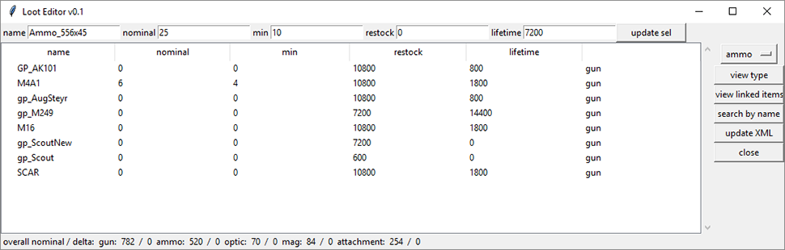

# dayzLootEditor
Visualize loot as list from database Edit and update types.xml
Built opon a a mysql database mostly generated and some manual editing
written in python.
types.xml needs to be in working directory

## Install
first off install MYSQL x64 Server 
- Windows: [here](https://dev.mysql.com/downloads/windows/installer/8.0.html) 
- Mac [here](https://dev.mysql.com/downloads/mysql/)

Optionally you could install the workbench 64bit to edit database from there

Now you need the odbc driver from here: https://dev.mysql.com/downloads/connector/odbc/5.3.html
again make sure to download and install the 64 bit version.

### Developer install

pyodbc
pyinstaller

## Features
Press Enter to search by name or update entries to database!

### item searching

search for items that contain the input in the name tag

### view linked items
select an item and click "view linked items":
it will show all items that can be attached to the item or are assossiated with it like ammo types, mags... this works for all supported item types

#### items that are linked to the FAL

#### guns that are assosiated with 556 Ammo

### overall loot info

this shows overall nominal added up for all gun, mags... as well as the change since you started the programm. So you can check if you overall increased or decreased the loot count

### supported categories:
All items of the game are loaded and found if searched but the sorting only works for these types of items

## Future Releases:

### Requirements for BETA
- [ ] doing item assossiation inside the app
- [ ] support for all item types
- [ ] guns can be assinged an ammo type which creates automatic assossiations
- [ ] Enter Hotkey in Rarity Distribution
- [x] managing db connection

### Requirements for Full Release
- [ ] Beeing able to add paste in new items and assossiate these items with a mod that can be activated and deactivated
- [ ] drop percentages (not in types.xml)
- [ ] overall loot settings (adjust for many items at once)
- [x] enter hotkey: when editing name -> search, nominal... -> update sel, selecting -> select matching
- [x] loading types.xml and then generating all database from that 
- [ ] finding ammo for vanilla guns
- [ ] attachments for vanilla guns
- [x] loading database with all links allready included
- [ ] 60round stanag is not implemented
- [x] Crate Rarity in database include dropdown in item, base rarity on allready existing items - then distribute across nominal

### crazy ideas:

- [ ] creating online database for all mods where people can add their itemsmods types.xml entries and a checkbox in app for a specific mod to add to types xml.
- [ ] simulation of loot in game over time without having to run the game. graph for all items
