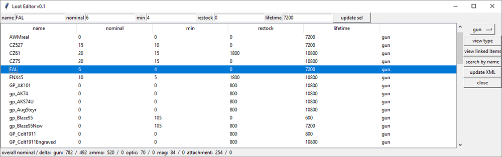
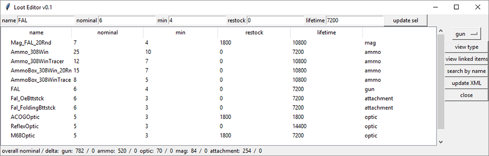

# DayZ LootEditor
DayZ Loot Editor for types.xml.
Helps with Visualizing end editing Loot. Has some Automatic functions for Loot distribution

- Visualize loot as a list from database
- Automatically creates Sub-types for weapon items and links items that are used together (guns, ammo, mags,...)
- Easily edit Loot Manually thanks to sub types and item linking
- Set Rarity of item
- Automatically generate distributions based on Rarity
- Set appearence of linked item (example: if gun is rare, the ammo is also rare)
- Export back to types.xml

Built upon a MySQL database that will be automatically generated and some manual editing of item links.
written in python.

## Install
first off install MYSQL x64 Server 
- Windows: [here](https://dev.mysql.com/downloads/windows/installer/8.0.html) 
- Mac [here](https://dev.mysql.com/downloads/mysql/)

Optionally you could install the workbench 64bit to edit database from there

Now you need the ODBC driver from here: https://dev.mysql.com/downloads/connector/odbc/5.3.html
again make sure to download and install the 64-bit version.

### Developer install

pyodbc
pyinstaller

## Features
Press Enter to search by name or update entries to database!

### item searching

search for items that contain the input in the name tag

### view linked items
select an item and click "view linked items":
it will show all items that can be attached to the item or are associated with it like ammo types, mags... this works for all supported item types

#### items that are linked to the FAL

#### guns that are assosiated with 556 Ammo

### overall loot info

this shows overall nominal added up for all gun, mags... as well as the change since you started the program. So you can check if you overall increased or decreased the loot count

### supported categories:
All items of the game are loaded and found if searched but the sorting only works for these types of items

## Future Releases:

### Requirements for BETA

#### Distribution
- [ ] choice if distributing by rarity or nominal
- [ ] abillity to distribute rarity across type/category or usage or tier
- [ ] lock items from distribution (possibly rarity unassigned)
- [ ] Ammo Distribution
- [ ] Enter Hotkey in Rarity Distribution
- [x] Optic Distribution
- [x] Crate Rarity in the database include dropdown in items. Derive rarity on already existing items - then distribute across nominal

#### Main Display
- [ ] abillity to view by type/category or usage or tier
- [x] show nominals of currentry displayed items
- [ ] writing new types.xml
- [ ] show usages and tiers of items (2 new columns)
- [x] support for all item types
- [x] enter hotkey: when editing name -> search, nominal... -> update selection, selecting -> select matching
- [x] fix saving db
- [x] fix saving types

#### Item Association
- [ ] Doing item association inside the app
- [ ] guns can be assigned an ammo type which creates automatic associations

#### Database
- [x] managing DB connection
- [x] loading database with all links already included
- [x] loading types.xml and then generating all database from that 

#### General
- [ ] Updating Screenshots Creating Public Repository

### Requirements for Full Release
- [ ] App icon
- [ ] Mac and Linux Support
- [ ] Attachment Distribution
- [ ] Being able to paste in new items and associate these items with a mod that can be activated and deactivated
- [ ] finding ammo for vanilla guns
- [ ] attachments for vanilla guns
- [ ] Loading / Exporting single tables and selected items, not entire databases
- [ ] Loot Drop Location editing (Military, Hunting, ...)

### Possible Features
- [ ] Rewriteing Common Database connection errors
- [ ] drop percentages (not in types.xml)
- [ ] overall loot settings (adjust for many items at once)
- [ ] Where the heck is the 60round STANAG??

### Crazy ideas:
- [ ] creating an online database for all mods where people can add their items mods types.xml entries and a checkbox in-app for a specific mod to add to types XML.
- [ ] simulation of loot in-game over time without having to run the game. graph for all items
